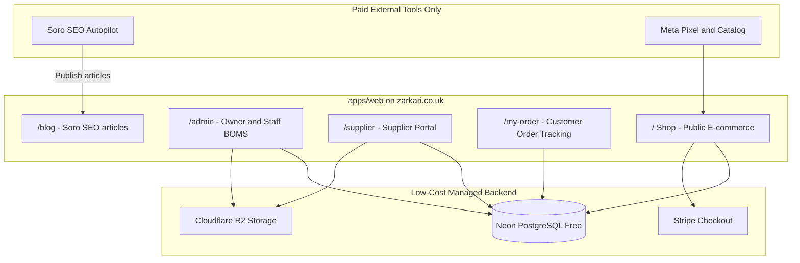
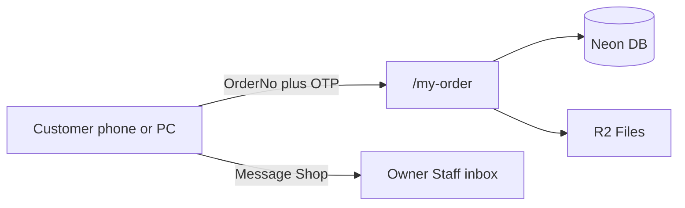
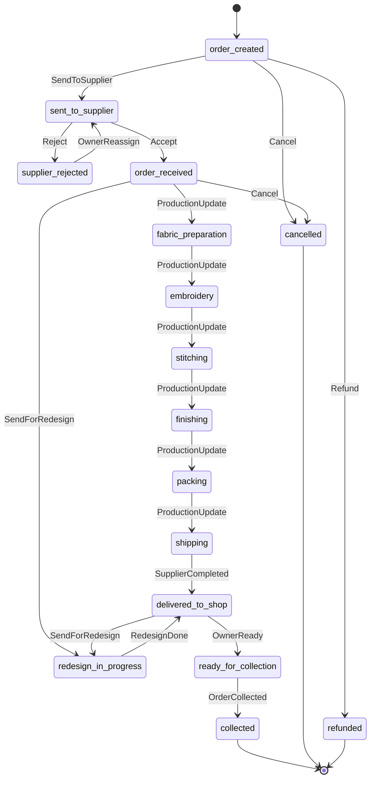
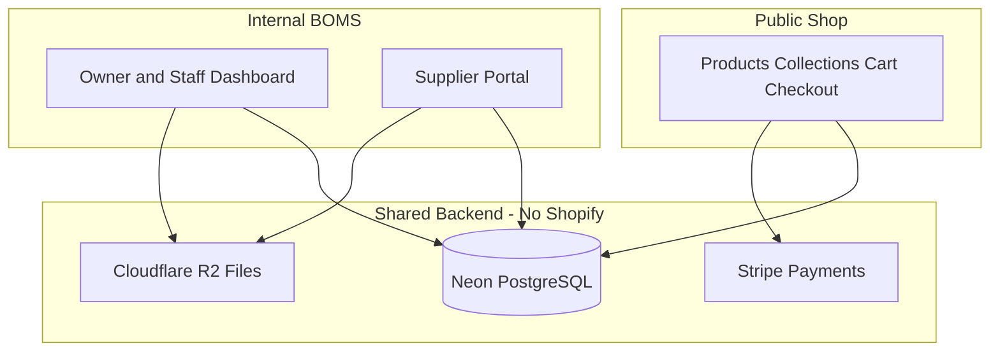
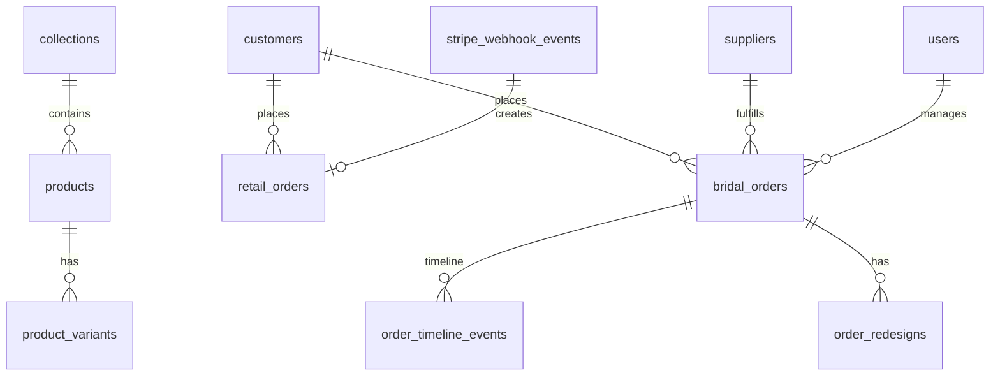
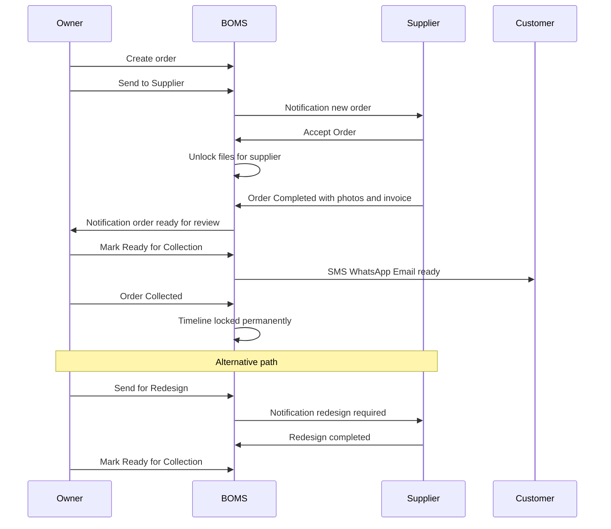

# ZARKARI Custom Platform (Shop + BOMS)

## Context

The client wants a **fully custom-built platform** — no Shopify, no monthly platform subscriptions. Everything runs on their own domain with minimal running costs.

**Two products in one platform:**

1. **Public E-commerce Shop** — ready-to-wear retail (lawn, pret, formal, unstitched) with online checkout
2. **Bridal Order Management System (BOMS)** — custom bridal orders with supplier workflow, production tracking, payments, and reports

**Confirmed decisions:**
- **No Shopify** — remove all Shopify API integration from existing storefront
- **Custom catalog, cart, checkout, and order management** — built in-house
- **Hosting**: low-cost managed stack — Vercel (free) + Neon Postgres (free) + Cloudflare R2 (free)
- **Payments**: Stripe Checkout (UK) — pay-per-transaction only (~1.5% + 20p), no monthly platform fee
- **External paid tools (only these):**
  - **Soro** — automated SEO blog publishing for marketing
  - **Meta** — Pixel + Instagram/Facebook catalog for ads and promotion
- **BOMS**: responsive web + PWA; **17-step Executive Workflow** (client final vision, see below)
- **Domain**: `zarkari.co.uk` (shop + admin + supplier + **customer order tracking** on same deployment)



---

## What Gets Removed

| Removed | Replaced By |
|---------|-------------|
| Shopify Storefront API | Custom product/collection tables in Neon |
| Shopify Admin / checkout | Stripe Checkout + custom order tables |
| Shopify Payments subscription | Stripe (transaction fees only) |
| Supabase | Neon Postgres + Cloudflare R2 |
| Klaviyo | Resend free tier for transactional email |
| Shopify-dependent Soro setup | Soro → custom blog API endpoint |

Existing [apps/storefront](apps/storefront) Shopify code (`lib/shopify/`, mock-data fallback, `/api/cart` Shopify mutations) will be **removed and replaced** with custom DB-backed commerce.

---

## Client Final Vision

> *The system should function as a complete digital factory and customer management platform, replacing paper records and manual follow-ups.*

**Project goal:** Secure cloud-based BOMS on PC, Android, iPhone, and Web — owner and suppliers manage custom orders from booking to collection with complete tracking and history.

---

## BOMS Executive Workflow (17 Steps — Client Final Spec)

### Step 1 — Customer Order (Create)

Owner/Staff creates order with auto Order ID, customer details, measurements/customisations, uploads (order form, measurement sheet, photos, customisation video). Default **50% deposit**, delivery date **8 weeks** from booking. → status `order_created`.

### Step 2 — Order Dashboard (Card UI)

Card shows: Order Number, Customer Name, Supplier, Booking/Delivery dates, Deposit, Balance, Status. **Right side countdown:** Green >20 days, Yellow 11–20, Red ≤10, Black/Dark Red overdue. Updates daily + cron reminders. Component: [apps/web/src/components/orders/OrderCard.tsx](apps/web/src/components/orders/OrderCard.tsx)

### Step 3 — Order Action Buttons

Active orders always show: Send to Supplier, Cancel, Refund, Send for Redesign, Order Collected. Staff **cannot refund**. Owner-only: Cancel, Refund, Redesign.

### Step 4 — Supplier Portal

Secure `/supplier` login. Each supplier sees **only assigned orders**. Never sees: other suppliers, payments, reports, financial data.

### Step 5 — Supplier Acceptance

New orders: **Accept** or **Reject** only. Reject → reason + comment + optional evidence → returns to owner. Accept → unlocks measurements, videos, photos, notes, design details.

### Step 6 — Production Tracking

Stages: Order Received → Accepted → Fabric Preparation → Embroidery → Stitching → Finishing → Packing → Shipping → Delivered to Shop. Owner monitors in real time.

### Step 7 — Redesign Management

Owner: Send for Redesign → reason, comment, photos, videos, files → supplier instant notification → permanent history.

### Step 8 — Cancellation Management

Owner or supplier (before completion): reason, comment, optional proof → Cancelled History (soft archive, never hard-deleted).

### Step 9 — Refund Management

Owner-only: reason, comment, amount, payment method, date, evidence → Refund History.

### Step 10 — Supplier Completion

Order Completed requires: delivery date, bill number, photos (min 1). Optional: courier/tracking, video. Supplier locked after submit.

### Step 11 — Order Collection

Order Collected: collection date, balance paid, amount received, outstanding, alteration notes, staff comments → Completed Orders.

### Step 12 — Automatic Notifications

In-app + email on PC/mobile: acceptance, production updates, deadlines, late orders, redesign, completion, ready, cancel, refund. SMS/WhatsApp in future phase.

### Step 13 — Search System

Instant search: customer name, phone, order number, supplier, date, status, cancelled, refunded, collected — all historical records.

### Step 14 — Reports & Analytics

Daily/weekly/monthly/yearly: orders, revenue, deposits, outstanding, refunds, cancellations, redesigns, late deliveries, supplier performance.

### Step 15 — Supplier Performance

Auto-tracked: total, successful, wrong, redesigns, refunds, cancellations, late deliveries, success rate %.

### Step 16 — Permanent Order Timeline

Append-only audit trail: Order Created, Sent to Supplier, Accepted, Rejected, Production Started, Redesign Requested, Cancelled, Refunded, Completed, Collected. Each event: date, time, user, comment, attachments. **Never deletable.**

### Step 17 — Security & Access

**Owner:** full control. **Staff:** create/update orders, no refund, no delete. **Supplier:** assigned orders only, isolated from all other suppliers.

---

## Customer Access — "My Bridal Order"

Customers track their bridal order without accessing admin or supplier systems. Mobile-friendly page at **`/my-order`** (or `/my-order/[orderNumber]` after login).

### How customers log in

No full account required at launch. **Order lookup + verification:**

1. Customer enters **Order Number** (e.g. `BR-2026-0152`) + **phone number** on file
2. System sends **OTP via SMS or email** (or magic link via Resend email)
3. Session scoped to that customer’s order(s) only

Optional later: link to retail shop customer account if same email.

On order creation (Step 1), staff sends customer a link: `zarkari.co.uk/my-order?order=BR-2026-0152`

### Order summary card (customer view)

```
My Bridal Order
Order No: BR-2026-0152
Status: Embroidery in Progress
Supplier: Hidden                    ← never shown to customer
Delivery Date: 15 August 2026
Time Left: 18 Days Remaining        ← same colour rules as admin
Deposit Paid: £500
Remaining Balance: £500
```

Order number format: `BR-{YYYY}-{sequence}` (e.g. `BR-2026-0152`).

### Progress tracker (customer-facing labels)

Visual checklist — completed ✅, current 🟡, upcoming ⬜:

| Step | Customer label | Maps from internal status |
|------|----------------|---------------------------|
| 1 | Order Confirmed | `order_created` |
| 2 | Sent to Supplier | `sent_to_supplier` |
| 3 | Supplier Accepted | `order_received` / accepted |
| 4 | Fabric Ready | `fabric_preparation` |
| 5 | Embroidery | `embroidery` |
| 6 | Stitching | `stitching` |
| 7 | Finishing | `finishing` |
| 8 | Shipping | `packing` + `shipping` + `delivered_to_shop` |
| 9 | Ready for Collection | `ready_for_collection` |
| 10 | Collected | `collected` |

Redesign in progress shows as: **"Quality Check — Amendments in Progress"** (no internal supplier details).

Component: [apps/web/src/components/customer/OrderProgressTracker.tsx](apps/web/src/components/customer/OrderProgressTracker.tsx)

### Customer action buttons

| Button | Behaviour |
|--------|-----------|
| **View Uploaded Design** | Read-only gallery of customer’s design photos/files |
| **View Measurements** | Read-only measurement sheet (PDF/image) |
| **View Customisation Notes** | Read-only text notes from booking |
| **Message Shop** | Simple messaging thread → notifies owner/staff (in-app + email) |
| **Download Receipt** | PDF of deposit payment(s) generated from `payments` table |

Customer **cannot** see: supplier name, internal timeline comments, staff notes, other orders, financial reports.

### Customer notifications (Step 12 extension)

When production stage advances or order is ready for collection, customer receives email (Resend) with link back to `/my-order`. SMS in future phase.



---

## Future Enhancements (Post v1)

QR code, barcode scanning, WhatsApp/SMS, digital signature, calendar view, invoices/receipts, AI overdue reminders.

---

### Full Status Flow





---

## Recommended Stack (Zero Platform Subscription)

| Layer | Technology | Cost |
|-------|-----------|------|
| **App** | Next.js 16 + TypeScript + Tailwind | $0 (Vercel Hobby) |
| **Database** | **Neon PostgreSQL** (free tier: 0.5 GB, 1 project) | $0 |
| **ORM** | Drizzle ORM | $0 |
| **Auth** | Better Auth or Auth.js v5 (credentials + roles in Neon) | $0 |
| **File storage** | **Cloudflare R2** (free tier: 10 GB) | $0 |
| **Payments** | **Stripe Checkout** (UK cards, Apple Pay, Google Pay) | ~1.5% + 20p per sale only |
| **Email** | Resend free tier (3,000 emails/mo) | $0 |
| **Hosting** | Vercel Hobby on `zarkari.co.uk` | $0 |
| **Domain** | Client's registrar | ~£10/yr |
| **SEO/Marketing** | **Soro** (automated blog) | ~$39–99/mo |
| **Ads/Promotion** | **Meta Pixel + Catalog** | $0 (ad spend separate) |
| **PWA** | `@serwist/next` for BOMS mobile install | $0 |
| **Cron jobs** | Vercel Cron (countdown alerts, backups) | $0 |

**Total fixed monthly cost at launch: ~$39–99/mo (Soro only) + Stripe transaction fees + optional Meta ad spend**

---

## Monorepo Structure (Unified Platform)

```
zarkari/
├── apps/
│   └── web/                         # Single Next.js app (refactor from storefront)
│       ├── src/app/
│       │   ├── (shop)/              # Public e-commerce — zarkari.co.uk
│       │   │   ├── page.tsx         # Homepage
│       │   │   ├── products/
│       │   │   ├── collections/
│       │   │   ├── cart/
│       │   │   ├── checkout/        # Stripe Checkout redirect
│       │   │   └── blog/            # Soro publishes here
│       │   ├── (admin)/             # Owner + Staff BOMS — zarkari.co.uk/admin
│       │   │   ├── dashboard/
│       │   │   ├── orders/          # Bridal orders
│       │   │   ├── products/        # Retail catalog CRUD
│       │   │   ├── customers/
│       │   │   ├── reports/
│       │   │   └── finance/
│       │   ├── (supplier)/          # Supplier portal — /supplier
│       │   ├── (customer)/          # Customer tracking — /my-order
│       │   │   ├── page.tsx         # Order lookup login
│       │   │   └── [orderNumber]/   # My Bridal Order view
│       │   ├── (auth)/login/
│       │   └── api/
│       │       ├── stripe/webhook/
│       │       ├── soro/publish/    # Soro blog webhook
│       │       └── upload/          # R2 presigned URLs
│       └── public/
├── packages/
│   └── db/                          # Shared Drizzle schema
│       ├── schema/
│       │   ├── products.ts          # Retail catalog
│       │   ├── retail-orders.ts     # Online shop orders
│       │   ├── bridal-orders.ts     # BOMS orders
│       │   ├── users.ts             # Auth + roles
│       │   └── blog.ts              # Soro articles
│       └── migrations/
└── docs/
```

One Vercel deployment, one Neon database, one domain — **no separate Shopify or BOMS subscription**.

---

## Custom E-commerce Module (Replaces Shopify)

### Owner manages catalog in `/admin/products`

| Feature | Implementation |
|---------|----------------|
| Products | CRUD with title, price, variants (size/color), SKU, images |
| Collections | Lawn, Pret, Formal, Unstitched, New Arrivals |
| Inventory | Stock count per variant; low-stock flag |
| Images | Upload to Cloudflare R2; served via CDN |
| Orders | Retail orders from Stripe webhook → `retail_orders` table |
| Checkout | Stripe Checkout Session → redirect back to confirmation page |
| Refunds | Stripe Refund API from admin panel |

### Customer shop flow (unchanged UX, new backend)

Browse → Product detail → Add to cart (DB/session) → Checkout → Stripe → Order confirmation email (Resend)

### Soro integration (marketing only)

- Soro connects to `POST /api/soro/publish` webhook
- Writes SEO articles to `blog_posts` table
- Articles render at `/blog/[slug]` — same as current storefront blog pages
- No Shopify required

### Meta integration (promotion only)

- Meta Pixel on all shop pages (already scaffolded in storefront Analytics component)
- Product catalog feed at `/api/meta/catalog.xml` generated from `products` table
- Connect in Meta Business Manager for Instagram/Facebook shopping ads

---

## Database Schema (Unified)

Two order types in one database:

| Table group | Purpose |
|-------------|---------|
| `products`, `product_variants`, `collections` | Retail e-commerce catalog |
| `retail_orders`, `retail_order_items` | Online shop orders (from Stripe) |
| `bridal_orders`, `order_timeline_events`, `order_redesigns`, etc. | BOMS bridal workflow |
| `customer_messages` | Message Shop threads (customer ↔ staff) |
| `customers` | Shared customer profiles (retail + bridal history) |
| `users` | Auth: owner, staff, supplier roles |
| `suppliers` | Supplier profiles linked to user accounts |
| `blog_posts` | Soro-published SEO articles |
| `files` | All uploads in R2 (product images, order measurements, etc.) |



### Supplier data isolation

Enforced in **application middleware** (not Supabase RLS — using Neon):
- Supplier API routes filter by `supplier_id = session.user.supplierId`
- File access gated by `files_unlocked_at` and order assignment
- Staff blocked from finance/report routes via role middleware

---

## Module Implementation Map (Maps to 17 Steps)

| Step | Implementation |
|------|----------------|
| 1 – Customer Order | New order form; 50% deposit default; 8-week delivery default; file uploads to R2 |
| 2 – Dashboard | Order cards with countdown badge (green/yellow/red/dark red) |
| 3 – Action Buttons | `OrderActionBar` — 5 persistent buttons; staff blocked from refund |
| 4 – Supplier Portal | `/supplier` with isolated dashboard per supplier |
| 5 – Acceptance | Accept/Reject; file unlock on accept |
| 6 – Production | 9-stage stepper; supplier updates; owner read-only monitor |
| 7 – Redesign | `RedesignModal` → `order_redesigns` + notification |
| 8 – Cancellation | Cancel modal → Cancelled History (soft archive) |
| 9 – Refund | Owner-only refund modal → Refund History |
| 10 – Supplier Complete | Required upload validation before submit; supplier lock |
| 11 – Collection | Collection form → Completed Orders |
| 12 – Notifications | In-app bell + Resend email; Vercel Cron for deadlines |
| 13 – Search | Postgres full-text across all records |
| 14 – Reports | Date-filtered analytics; CSV export |
| 15 – Supplier Performance | Auto-calculated metrics dashboard |
| 16 – Timeline | Append-only `order_timeline_events`; no DELETE |
| 17 – Security | Role middleware; staff no refund/delete; supplier isolation |
| **Customer Portal** | `/my-order` — OTP login; progress tracker; hidden supplier; message shop; receipt PDF |

---

## Role Permissions Matrix

| Action | Owner | Staff | Supplier |
|--------|-------|-------|----------|
| View all orders | Yes | Yes | Assigned only |
| Create order | Yes | Yes | No |
| Send to Supplier | Yes | Yes | No |
| Send for Redesign | Yes | No | No |
| Cancel order | Yes | No | In-progress only |
| Refund | Yes | No | No |
| Order Collected / Completed | Yes | Yes | No |
| Accept / Reject order | No | No | Yes (new orders) |
| Order Completed (submit) | No | No | Yes (with required uploads) |
| View files (measurements etc.) | Yes | Yes | After accept only |
| Edit after supplier completion | Yes (reopen) | No | No (locked) |
| Delete any records | Yes | **No** | No |
| View payments / reports | Yes | No | No |

### Customer (via `/my-order` after OTP)

| Action | Customer |
|--------|----------|
| View own order status & progress | Yes |
| View design, measurements, notes | Yes (own order only) |
| See supplier name | **No — always hidden** |
| Message shop | Yes |
| Download receipt | Yes |
| Cancel / refund / admin actions | No |

---

## Bridal Order Status Enum

Production: `order_received` → `fabric_preparation` → `embroidery` → `stitching` → `finishing` → `packing` → `shipping` → `delivered_to_shop`

Lifecycle: `order_created` → `sent_to_supplier` → (`supplier_rejected` | production stages) → `redesign_in_progress` → `ready_for_collection` → `collected`

Terminal: `collected`, `cancelled`, `refunded`

Each transition appends to **`order_timeline_events`** (immutable, no DELETE).

---

## UI / UX Direction

Match ZARKARI brand (cream/charcoal/gold from storefront) but optimised for **operations**, not marketing:

- **Order list**: card grid (not plain table) — each card shows Step 1 layout with countdown on right
- **Order card action bar**: 5 persistent buttons (Step 2) visible on all non-final orders
- **Order detail**: tabbed — Details | Timeline (Step 9) | Files | Payments | Redesign History
- **Supplier portal**: inbox of assigned orders; new orders show Accept/Reject only; in-progress shows Order Completed + Cancel
- **Modals**: Redesign, Cancel, Refund, Supplier Completion — all with file upload + validation

Install prompt on first mobile visit: "Add ZARKARI BOMS to Home Screen"

---

## Notification Flow



**Phase 1 notifications:** Email (Resend) + in-app notification bell  
**Phase 2:** SMS (Twilio) + WhatsApp Business API

---

## Phased Delivery Plan

### Phase 1 — Platform Foundation (Weeks 1–3)
- Create `packages/db` with Drizzle + Neon; run initial migration
- Refactor `apps/storefront` → `apps/web`; **remove all Shopify code**
- Auth (Owner, Staff, Supplier) with role-based routing
- Admin product/collection CRUD with R2 image upload
- Public shop pages wired to Neon (replace mock-data)

### Phase 2 — E-commerce Checkout (Weeks 4–5)
- Cart (session-based) + Stripe Checkout integration
- Stripe webhook → create `retail_orders`
- Order confirmation email via Resend
- Blog table + Soro publish API endpoint
- Meta Pixel + product catalog XML feed

### Phase 3 — BOMS Core Flow (Weeks 6–8)
- Steps 1–2: Order creation (50% deposit, 8-week default) + dashboard cards with countdown
- Steps 3–5: Action buttons + supplier Accept/Reject + file unlock
- Step 6: Production stage stepper (9 stages)
- Steps 10–11: Supplier completion + order collection
- Step 16: Immutable timeline component

### Phase 4 — BOMS Workflows (Weeks 9–10)
- Steps 7–9: Redesign, cancellation, refund modals + histories
- Steps 12–15: Notifications, search, reports, supplier performance
- Step 17: Security hardening, audit log
- **Customer portal:** `/my-order` with OTP login, progress tracker, message shop, receipt download

### Phase 5 — Launch (Week 11)
- PWA manifest for admin/supplier mobile use
- Deploy to `zarkari.co.uk` on Vercel
- Connect Soro + Meta in client accounts
- Remove deprecated Shopify docs and env vars

---

## Estimated Costs (Monthly)

| Service | Cost |
|---------|------|
| Vercel Hobby | $0 |
| Neon Postgres (free tier) | $0 |
| Cloudflare R2 (free tier) | $0 |
| Resend (free tier) | $0 |
| Domain (zarkari.co.uk) | ~£0.80/mo |
| **Soro SEO** | **~$39–99/mo** |
| **Stripe** | 1.5% + 20p per transaction only |
| Meta Pixel + Catalog | $0 (ad budget separate) |
| **Total fixed cost** | **~$40–100/mo** |

Compare to previous Shopify stack: ~~£25–65/mo Shopify~~ + ~~$25/mo Supabase~~ = **~$80–150/mo before any sales**. New stack is cheaper at rest; Stripe fees only apply when selling.

---

## Key Files to Create / Modify

| Path | Action |
|------|--------|
| [packages/db/schema/](packages/db/schema/) | NEW — unified Drizzle schema |
| [apps/web/](apps/web/) | REFACTOR from storefront — remove `lib/shopify/` |
| [apps/web/src/app/api/stripe/webhook/route.ts](apps/web/src/app/api/stripe/webhook/route.ts) | NEW — Stripe payment webhook |
| [apps/web/src/app/api/soro/publish/route.ts](apps/web/src/app/api/soro/publish/route.ts) | NEW — Soro blog webhook |
| [apps/web/src/app/(admin)/products/](apps/web/src/app/(admin)/products/) | NEW — catalog admin CRUD |
| [apps/web/src/components/orders/OrderCard.tsx](apps/web/src/components/orders/OrderCard.tsx) | NEW — BOMS admin order card |
| [apps/web/src/components/customer/MyBridalOrder.tsx](apps/web/src/components/customer/MyBridalOrder.tsx) | NEW — customer order summary |
| [apps/web/src/components/customer/OrderProgressTracker.tsx](apps/web/src/components/customer/OrderProgressTracker.tsx) | NEW — 10-step progress checklist |
| [apps/web/src/app/(customer)/my-order/](apps/web/src/app/(customer)/my-order/) | NEW — customer portal routes |
| [apps/web/src/lib/orders/status-machine.ts](apps/web/src/lib/orders/status-machine.ts) | NEW — status transitions + customer label mapping |

---

## What Gets Deleted

- [apps/storefront/src/lib/shopify/](apps/storefront/src/lib/shopify/) — entire directory
- [docs/shopify-uk-setup.md](docs/shopify-uk-setup.md) — replaced with custom stack docs
- [scripts/shopify/](scripts/shopify/) — no longer needed
- Shopify env vars from `.env.example`
- `@shopify/hydrogen-react` dependency

---

## Summary

| Question | Answer |
|----------|--------|
| **Shopify?** | No — fully custom |
| **Platform subscriptions?** | None (only Soro + Stripe per-transaction) |
| **Hosting** | Vercel + Neon + Cloudflare R2 (all free tiers) |
| **E-commerce** | Custom catalog + Stripe Checkout |
| **BOMS** | Custom bridal workflow on same platform |
| **Marketing** | Soro (blog SEO) + Meta (ads/pixel) |
| **Domain** | `zarkari.co.uk` — shop `/`, admin `/admin`, supplier `/supplier`, customer `/my-order` |
| **Customer access** | OTP login; progress tracker; supplier hidden; message shop; receipt download |
| **Order number format** | `BR-2026-0152` |
| **Timeline** | ~11 weeks to full platform v1 |
