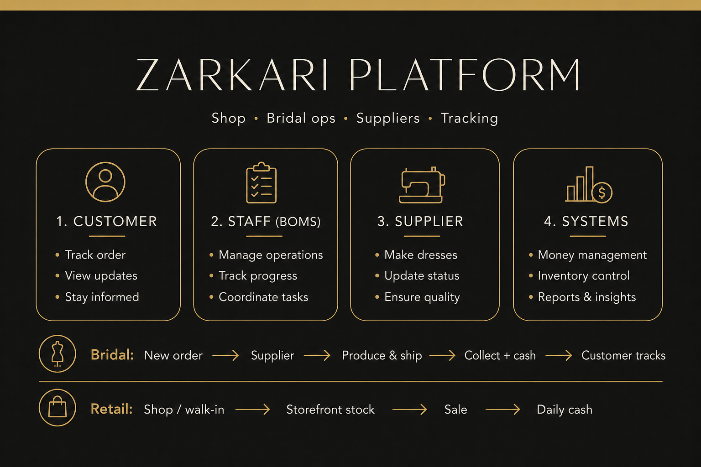

# ZARKARI Employee Handbook

**How the system works, what it is for, and how to use it day to day.**

Live site: [www.zarkari.co.uk](https://www.zarkari.co.uk)  
In-app guided tours: **Admin → Training** (`/admin/training`)



> **Tip:** Open [`system-overview.html`](system-overview.html) in your browser for an **animated** version of the diagram above.

---

## 1. Purpose of this system

ZARKARI runs on **one platform** with four faces:

| Surface | Who uses it | What it is for |
|---------|-------------|----------------|
| **Public shop** (`/`) | Customers | Browse collections, buy ready-to-wear online |
| **BOMS admin** (`/admin`) | Owner & staff | Bridal orders, cash, stock, suppliers, cargo, inbox, content |
| **Supplier portal** (`/supplier`) | Dressmakers / ateliers | Accept bridal work and update production stages |
| **My Order** (`/my-order`) | Bridal customers | Track their custom order (order number + WhatsApp phone) |

**BOMS** means Bridal Order Management System. It is the back office that keeps bridal bookings, payments, production, shipping, and the till organised in one place.

**Why it exists**

- Stop chasing orders on paper, WhatsApp chats, and spreadsheets
- Give suppliers a clear list of work and stages
- Let customers see progress without calling the shop every day
- Keep cash, stock, and supplier accounts (khata) accurate

---

## 2. Who uses what (roles)

Staff and suppliers log in at `/login`. Customers do **not** get a staff login — they use My Order.

| Role | Can access | Typical work | Limits |
|------|------------|--------------|--------|
| **Owner** | Full `/admin` | Everything staff can do, plus Users, refunds, deleting records, editing settings | — |
| **Staff** | `/admin` (no Users page) | Create bridal & walk-in sales, cash, stock, cargo, inbox, content, reports | No refunds; cannot hard-delete records; settings usually read-only |
| **Supplier** | `/supplier` only | Accept/reject assigned bridal orders; advance production; upload completion photos | Cannot see other suppliers, cash, or shop finance |
| **Customer** | `/` and `/my-order` | Shop online; track bridal order | Cannot open admin or supplier areas |

---

## 3. Login and getting around

1. Go to `/login` and sign in with the email/password your manager gave you.
2. You land in the **admin sidebar** (or bottom menu on phone).
3. Use **Search** in the header for order ID, customer name, or phone.
4. Open **Training** anytime for interactive tours of each screen.
5. On a phone, you can install the admin as an app (install banner, or iPhone: Share → Add to Home Screen).

### Main admin menu

| Group | Pages |
|-------|--------|
| Overview | Dashboard |
| Orders & stock | Orders, New Order, Stock, Inbox |
| Finance | Daily Cash, Payments |
| People | Customers |
| Suppliers | Suppliers, Cargo & Boxes, Supplier Payments |
| Storefront | Content (products, collections, homepage, media, blog) |
| Planning | Calendar, Reports, Training |
| System | Notifications, Settings, Users *(owner only)* |

---

## 4. Bridal orders (custom dresses)

This is the heart of BOMS.

### Typical path (staff)

1. **New Order** (`/admin/orders/new`) — customer WhatsApp, dress details, deposit, delivery date (~8 weeks), photos/videos.
2. Order is created as **Order Created**.
3. **Send to supplier** when ready — supplier gets it on `/supplier`.
4. Supplier **Accepts** (or Rejects with a reason).
5. Supplier moves through production stages (fabric → embroidery → stitching → finishing → packing → shipping).
6. When the dress arrives at the shop, staff mark it received / ready for collection.
7. On collection day, take the **balance payment**, add notes if needed, and mark **Collected**.

### Status glossary (simplified)

| Stage | Meaning |
|-------|---------|
| Order Created | Booked in the system |
| Sent to Supplier | Waiting for atelier to accept |
| Order Received | Supplier accepted |
| Fabric / Embroidery / Stitching / Finishing / Packing | In production |
| Shipping | On the way to the shop |
| Delivered to Shop | In store |
| Ready for Collection | Customer can collect |
| Collected | Finished — balance taken |
| Cancelled / Refunded | Order stopped (refunds: owner) |

Optional: **Redesign in progress** if the customer changes the design after arrival.

### Dashboard & Orders list

- **Dashboard** (`/admin/dashboard`) — active, due this week, overdue, completed.
- **Orders** (`/admin/orders`) — filter bridal vs online vs walk-in; open a row for full detail.
- From an order page you can message the customer on **WhatsApp** with a green button.

---

## 5. Retail sales and stock

### Online shop sales

Customer buys on the website → Stripe checkout → order appears under **Orders** (online / shop). Stock comes from **storefront** inventory.

### Walk-in (ready-made) sales

Create a walk-in sale from the Orders area. It reduces **storefront** stock and can post cash as a Ready Made Sale.

### Stock (`/admin/stock`)

Two locations:

| Location | Meaning |
|----------|---------|
| **Internal** | Warehouse / not on the shop floor yet |
| **Storefront** | What the website and walk-in sales sell from |

Common actions: **Receive** into internal, **Transfer** internal ↔ storefront, **Adjust** when counting stock.

---

## 6. Daily cash and payments

### Daily Cash (`/admin/cash`)

Record money in and out for a day (or browse by date / period). You will see opening balance, cash in, cash out, and closing.

**Typical cash in**

- Order deposit  
- Order collection (balance)  
- Ready made sale  
- Other income  

**Typical cash out**

- Supplier payment  
- Business expenses  
- Refund  
- Partners / loans  
- Other  

Use the calendar control to jump to any day. Analytics live at `/admin/cash/analytics`.

### Payments (`/admin/payments`)

Overview of deposits and balances across orders — useful when chasing outstanding balances.

---

## 7. Suppliers, cargo, and khata

### Suppliers (`/admin/suppliers`)

Add supplier details. Owners can create a **login** so the supplier uses `/supplier` on their phone.

### Cargo & Boxes (`/admin/cargo`)

Track physical shipment boxes from overseas:

1. Add a box (cargo company, tracking, supplier, date).
2. Add line items with PKR/GBP costs; link lines to bridal orders (`ORD-…`) when relevant.
3. Optionally **Post to khata** so the box total becomes a stock entry on the supplier ledger — or keep cargo-only and update khata later.

### Supplier khata (`/admin/suppliers/[id]/khata`)

The supplier’s account book: bills, stock entries, and payments (GBP and PKR, running balance). Related: **Supplier Payments**.

**Remember:** Cargo = physical boxes. Khata = money/ledger with the supplier.

---

## 8. Inbox and notifications

- **Inbox** (`/admin/inbox`) — customer messages from Facebook, Instagram, WhatsApp, and manual inquiries in one place. Reply from the thread.
- **Notifications** (bell in the header, and `/admin/notifications`) — system alerts (new orders, messages, etc.). Mark as read when handled.

---

## 9. Storefront content

Under **Content** (`/admin/content`) staff/owners can manage what customers see on the shop:

- Products and collections  
- Homepage / hero videos  
- Media library (photos & videos)  
- Blog posts  

Only change live content when instructed — mistakes show on the public website immediately.

---

## 10. Customer tracking (My Order)

Tell bridal customers:

1. Go to **www.zarkari.co.uk/my-order**
2. Enter their **order number** and the **WhatsApp number** used on the booking
3. They can see progress, measurements/design info, and message the shop

They will **not** see internal supplier names or staff-only notes.

---

## 11. Calendar, reports, settings, users

| Page | Purpose |
|------|---------|
| Calendar | See deliveries and deadlines |
| Reports | Day / week / month / year summaries; print or save PDF |
| Settings | Shop/ops settings (owners edit; staff often view only) |
| Users | Owner-only — create staff and supplier logins |

---

## 12. FAQ

**How do I message a customer on WhatsApp?**  
Open any order and tap the green **Message on WhatsApp** button. It opens WhatsApp with a pre-filled message.

**How do I add a new supplier?**  
Go to Suppliers → Add Supplier. Fill in their details, then create a login account so they can access `/supplier`.

**How do I install the admin on my phone?**  
Look for the install banner, or on iPhone use Share → Add to Home Screen in Safari.

**How do I print a report?**  
On Reports or Cash Analytics, use **Print / Save PDF** or **Download PDF**.

**What is the difference between Cargo & Boxes and supplier khata?**  
Cargo records physical shipment boxes and contents. Khata is the supplier account ledger. Use **Post to khata** on a box when you want the box total added as a stock entry on that supplier’s khata.

**Where can I learn more inside the app?**  
Open **Training** (`/admin/training`) and run a guided tour for the screen you need.

---

## 13. Quick reference — important URLs

| URL | Purpose |
|-----|---------|
| `/login` | Staff & supplier login |
| `/admin/dashboard` | Ops home |
| `/admin/orders` | All orders |
| `/admin/orders/new` | New bridal booking |
| `/admin/cash` | Daily till |
| `/admin/stock` | Inventory |
| `/admin/cargo` | Shipment boxes |
| `/admin/inbox` | Social / WhatsApp inbox |
| `/admin/training` | Guided learning |
| `/supplier` | Supplier portal |
| `/my-order` | Customer bridal tracking |
| `/` | Public shop |

---

## 14. How the pieces fit together (summary)

```
CUSTOMER                    STAFF (BOMS)                 SUPPLIER
─────────                   ────────────                 ────────
Shop online ──► retail order ──► stock ↓
Bridal booking ◄─────────── New Order ──► Send ──► Accept → produce → ship
Track on /my-order ◄─────── status updates ◄────── stage updates
Pay deposit/balance ──► Daily Cash / Payments
Shipment arrives ──► Cargo & Boxes ──► (optional) Khata
```

Money stays in **Daily Cash** and **Payments**. Inventory stays in **Stock**. Overseas boxes stay in **Cargo**. Supplier money history stays in **Khata**. Bridal work moves between **Orders**, **Supplier portal**, and **My Order**.

---

*Document for ZARKARI employees. For interactive help inside the system, use Admin → Training.*
